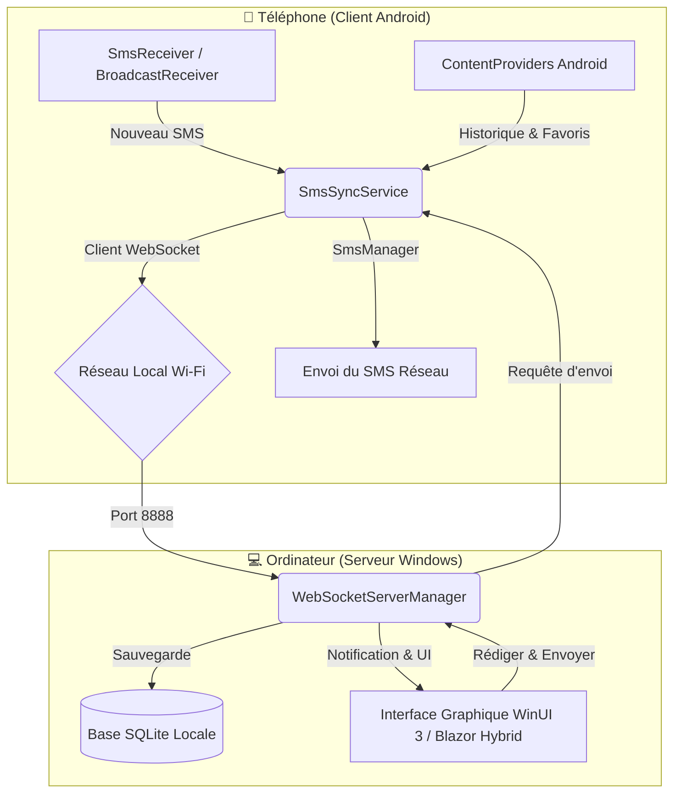

# 📱 SyncSmsToDesktop 💻

> **Synchronisation en temps réel de vos SMS Android directement sur votre bureau Windows.**

`SyncSmsToDesktop` est une solution open-source, moderne et sécurisée, permettant d'unifier l'expérience mobile et PC. Elle permet de synchroniser en temps réel vos SMS de votre téléphone Android vers votre ordinateur Windows, et de rédiger/répondre à vos messages directement depuis votre PC sans toucher à votre téléphone.

---

## 📖 À quoi sert cette solution ?

Cette solution résout le problème de la gestion des SMS lorsque vous travaillez sur votre ordinateur. Ses fonctionnalités clés incluent :

- **Lecture et Archivage hors-ligne** : Tous vos SMS reçus sont stockés localement sur votre PC dans une base de données SQLite pour un accès instantané et une recherche historique rapide.
- **Réception en temps réel** : Dès qu'un nouveau SMS arrive sur votre téléphone, il apparaît instantanément sur votre PC sous forme de notification et s'ajoute à la conversation.
- **Envoi de SMS depuis le bureau** : Rédigez vos messages avec votre clavier d'ordinateur et envoyez-les. La demande est transmise de manière transparente à votre téléphone, qui se charge de l'envoi sur le réseau cellulaire.
- **Synchronisation des contacts favoris** : Associe les noms des expéditeurs de votre carnet d'adresses plutôt que de simples numéros bruts pour une lecture confortable.
- **Confidentialité absolue** : Les données transitent directement de votre téléphone à votre PC via votre réseau Wi-Fi local grâce à un serveur WebSocket haute performance. Aucun serveur cloud tiers n'est impliqué.

---

## 🛠️ Comment ça marche ? (Architecture)

La solution repose sur une communication bidirectionnelle en réseau local (LAN) via **WebSockets** :



---

## 📂 Structure du projet

Le dépôt contient plusieurs projets adaptés à différents environnements technologiques :

*   [**`src/SmsSyncWindows`**](file:///e:/S5/chouteau/SyncSmsToDesktop/src/SmsSyncWindows) : Application de bureau native **WinUI 3** (Windows App SDK) écrite en C#/.NET 10. Elle héberge le serveur WebSocket et gère l'affichage moderne des conversations avec une base de données SQLite locale.
*   [**`src/SmsSyncAndroid`**](file:///e:/S5/chouteau/SyncSmsToDesktop/src/SmsSyncAndroid) : Client mobile natif **Android** écrit en **Kotlin**. Il implémente un *Foreground Service* robuste pour maintenir la connexion en arrière-plan et intercepte les SMS entrants.
*   [**`src/SmsSyncMaui`**](file:///e:/S5/chouteau/SyncSmsToDesktop/src/SmsSyncMaui) : Version multiplateforme du projet en **.NET MAUI / Blazor Hybrid** ciblant Android, iOS, Mac Catalyst et Windows (WinUI 3).
*   [**`src/MobileSmsSync`**](file:///e:/S5/chouteau/SyncSmsToDesktop/src/MobileSmsSync) : Client mobile **.NET MAUI / Blazor Hybrid** restreint aux plateformes Android et iOS.

---

## 🚀 Guide d'utilisation

### 1. Prérequis

*   **Réseau** : L'ordinateur et le téléphone doivent être sur le **même réseau local** (généralement le même réseau Wi-Fi).
*   **Windows** : Le **Mode Développeur** doit être activé sur votre PC Windows 10/11 pour exécuter l'application. (Vérifiable en PowerShell via `Get-WindowsDeveloperLicense`).
*   **Android** : Le téléphone doit tourner sous **Android 7.0 (API 24) ou version supérieure**.

---

### 2. Démarrage de l'application Bureau (PC)

Vous pouvez exécuter le serveur WebSocket via Visual Studio (en ouvrant le fichier de solution [WinSms.slnx](file:///e:/S5/chouteau/SyncSmsToDesktop/WinSms.slnx)) ou via la console .NET :

#### En ligne de commande .NET CLI :
1. Ouvrez une invite PowerShell dans le dossier [src/SmsSyncWindows](file:///e:/S5/chouteau/SyncSmsToDesktop/src/SmsSyncWindows).
2. Détectez automatiquement votre architecture et lancez l'application :
   ```powershell
   $arch = $env:PROCESSOR_ARCHITECTURE
   $Platform = if ($arch -eq 'AMD64') { 'x64' } else { $arch }
   dotnet run -c Debug -p:Platform=$Platform
   ```
3. L'application WinUI s'ouvre et affiche son statut d'écoute avec son adresse IP, par exemple : `ws://192.168.1.50:8888`.

> [!TIP]
> Des scripts de compilation et de publication préconfigurés pour Windows sont disponibles à la racine :
> - [publish-windows.cmd](file:///e:/S5/chouteau/SyncSmsToDesktop/publish-windows.cmd)
> - [publish-windows-self-contained.cmd](file:///e:/S5/chouteau/SyncSmsToDesktop/publish-windows-self-contained.cmd)

---

### 3. Installation et configuration du Client Mobile (Téléphone)

#### Option A : Client natif Android (`SmsSyncAndroid`)
1. Ouvrez le dossier [src/SmsSyncAndroid](file:///e:/S5/chouteau/SyncSmsToDesktop/src/SmsSyncAndroid) avec **Android Studio**.
2. Compilez et installez l'application sur votre smartphone Android (via débogage USB ou en générant l'APK).
3. Ouvrez l'application et **accordez les permissions demandées** :
    *   Lecture et réception de SMS (`READ_SMS`, `RECEIVE_SMS`)
    *   Envoi de SMS (`SEND_SMS`)
    *   Accès aux contacts (`READ_CONTACTS` pour synchroniser les favoris)
    *   Notifications (`POST_NOTIFICATIONS`)
4. Entrez l'adresse IP affichée sur le PC (ex: `192.168.1.50:8888`) puis appuyez sur **Connecter**.

#### Option B : Client .NET MAUI (`MobileSmsSync` ou `SmsSyncMaui`)
1. Assurez-vous d'avoir installé les workloads MAUI pour .NET 10.
2. Déployez l'application sur votre appareil Android connecté en USB :
   ```bash
   dotnet build -t:Run -f net10.0-android
   ```
3. Renseignez l'IP du serveur Windows et validez la connexion.

Une fois la connexion WebSocket établie, le téléphone démarre automatiquement la synchronisation initiale de l'historique et de vos contacts favoris.

---

## 📡 Spécification du Protocole (Format JSON)

La communication s'effectue en envoyant des trames de texte structurées en JSON. Chaque message respecte ce modèle :

```json
{
  "Type": "nom_du_message",
  "Payload": "objet_serialize_en_chaine_de_caracteres"
}
```

### Liste des messages gérés :

| Type | Émetteur ➔ Récepteur | Description |
|---|---|---|
| `request_sync` | PC ➔ Mobile | Demande de récupération globale de l'historique des SMS. |
| `sync_start` | Mobile ➔ PC | Signale le début de l'envoi de la synchronisation et indique le nombre total de messages. |
| `sync_progress`| Mobile ➔ PC | Transmet la progression de l'index de synchronisation (`Current` / `Total`). |
| `sync_end` | Mobile ➔ PC | Notifie la fin de la synchronisation initiale de l'historique. |
| `sms_history` | Mobile ➔ PC | Transmet un lot de messages SMS historiques pour sauvegarde en base de données. |
| `new_sms` | Mobile ➔ PC | Transmet un nouveau SMS reçu en temps réel sur le téléphone. |
| `favorite_contacts`| Mobile ➔ PC | Envoie la liste des contacts favoris (Nom, Numéro) pour l'association dans l'UI. |
| `send_sms` | PC ➔ Mobile | Demande d'envoi d'un nouveau SMS avec les propriétés `Address`, `Body`, et `RequestId`. |
| `send_sms_status`| Mobile ➔ PC | Retourne le statut de réussite ou d'échec de la demande d'envoi de SMS correspondante (`RequestId`). |

---

## 🛡️ Sécurité & Données Privées

*   **Zéro Cloud** : Aucune donnée de vos SMS, numéros, ou messages ne transite par Internet ou par un serveur externe. Tout reste confiné dans votre réseau Wi-Fi local.
*   **Archivage Local** : L'historique synchronisé est stocké dans une base de données SQLite locale sur votre ordinateur et n'est partagé avec aucun tiers.

---

## 📄 Licence

Ce projet est sous licence MIT. Pour plus d'informations, veuillez vous référer au fichier [LICENSE](file:///e:/S5/chouteau/SyncSmsToDesktop/LICENSE).
